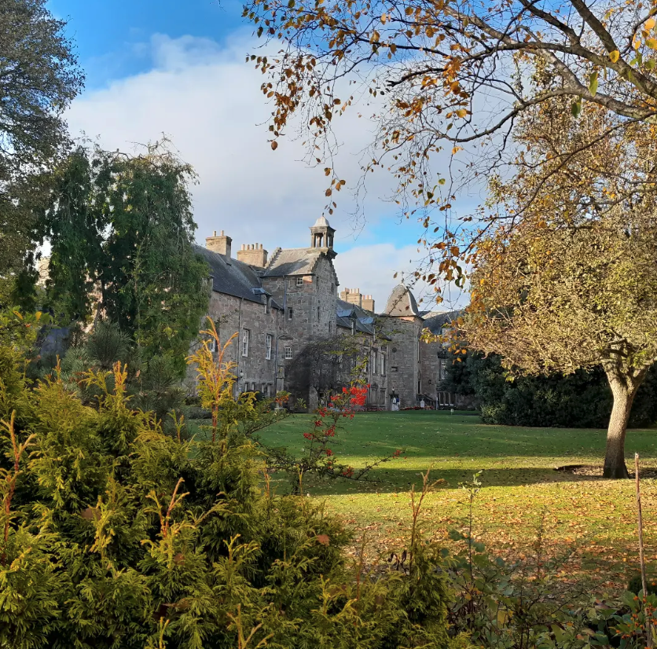
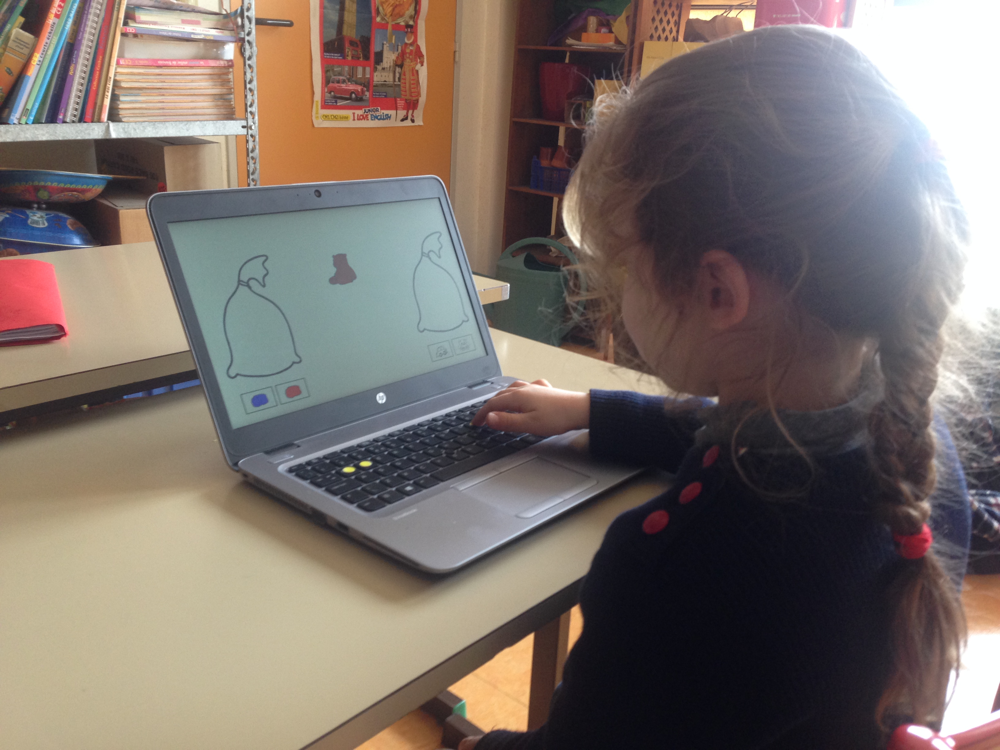
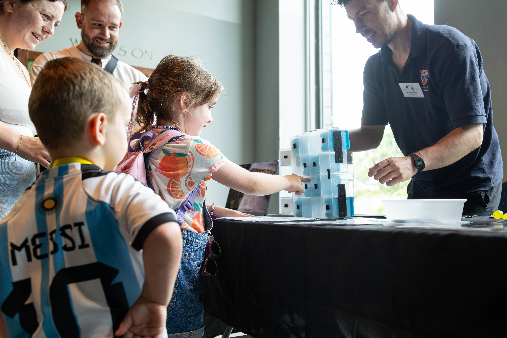
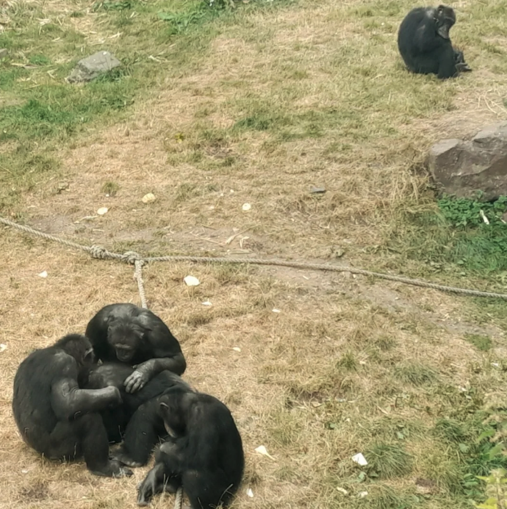
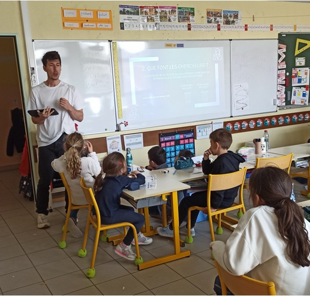
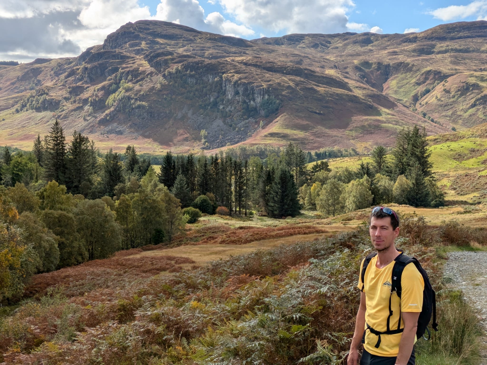

##### RESEARCH INTERESTS

Humans have an extraordinary capacity to regulate their thoughts and actions in richly social environments. We inhibit impulses under observation, adjust our behaviour to cultural norms, and strategically self-regulate in cooperative and competitive contexts. Yet executive function (EF or the set of cognitive processes supporting inhibition, working memory, and cognitive flexibility) is too often studied as if it were independent of the social world in which it operates.

How does the presence of others shape EF across development? How do children’s socialisation experiences and cultural backgrounds contribute to inter-individual differences in these effects? Do other species, and especially our closest living relatives (chimpanzees), regulate their behaviour in socially comparable ways?

My current research addresses these questions by integrating developmental, cross-cultural, and comparative approaches.

<figure style="margin:0;">

<figcaption class="text-muted" style="font-size:0.8em; margin-top:6px; text-align:center;">
St Mary's Quad, University of St Andrews (©Aurélien Frick) 

</figcaption>
</figure>

##### RESEARCH APPROACH AND PHILOSOPHY

I was originally trained as a developmental and cognitive psychologist using experimental methods to study EF under highly controlled conditions. This training provided me with strong expertise in developing cognitive tasks adapted for use with children and in applying quantitative methods (e.g., EEG) to investigate the mechanisms underlying executive processes.

However, investigating how EF operates in social environments has increasingly required methodological approaches that extend beyond those traditionally used in developmental cognitive research. As a result, in recent years my work has integrated experimental psychology with approaches more commonly used in fields such as anthropology and primatology. In addition to controlled experiments, I draw on qualitative methods (e.g., questionnaires and interviews) and observational approaches, including naturalistic observations of children in educational settings and behavioural observations of non-human primates within their social groups.

Combining quantitative and qualitative approaches allows me to examine EF both as a cognitive mechanism and as a form of behaviour embedded within complex social and cultural environments.

  <figure style="flex:1; margin:0;">
    
    <figcaption style="font-size:0.85em; text-align:center; margin-top:6px;">
      A 5-year-old child taking part in a cognitive research at school - 2019 (©Aurélien Frick)
    </figcaption>
  </figure>

  <figure style="flex:1; margin:0;">
    
    <figcaption style="font-size:0.85em; text-align:center; margin-top:6px;">
      Public outreach at Edinburgh Zoo, July 2025 (©Patrick Wood/GRCDI)
    </figcaption>
  </figure>

  <figure style="flex:1; margin:0;">
    
    <figcaption style="font-size:0.85em; text-align:center; margin-top:6px;">
      Observations on the troop of chimpanzees at Edinburgh Zoo - Summer 2025 (©Aurélien Frick)
    </figcaption>
  </figure>

Most of my research has taken place in local schools, where I actively engage by organising and delivering short, interactive activities that introduce children to key concepts in science and psychology. These sessions are hands-on and age-appropriate, encouraging curiosity and participation while giving children a direct experience of how research works. 

This outreach helps avoid “hit-and-run” approaches to research by fostering sustained, respectful relationships with schools, sharing findings in accessible ways, and ensuring that engagement is mutually beneficial. Through this, I aim not only to communicate scientific knowledge but also to foster early interest in research and make science accessible and meaningful to diverse audiences.

<figure style="margin:0;">

<figcaption class="text-muted" style="font-size:0.8em; margin-top:6px; text-align:center;">
Delivering a short activity about research to 7-8 years-old, May 2025
(©Delphine Allard)
</figcaption>
</figure>

##### ABOUT ME

<figure style="margin:0;">

<figcaption class="text-muted" style="font-size:0.8em; margin-top:6px; text-align:center;">
On the way down from Ben Ledi (©Helen Wright)
</figcaption>
</figure>

I am currently a Leverhulme Early Career Research Fellow in the School of Psychology and Neuroscience at the University of St Andrews (UK). Here, I study the effects of experimenter presence on children’s executive function using diverse approaches such as cognitive tasks, observations, questionnaires and interviews.

I also conduct some research at Edinburgh Zoo, and more specifically at the Budongo Research Unit,  non-human primates (chimpanzees).

##### SELECTED PUBLICATIONS

<strong>Frick, A.</strong>, McEwen, E. S., & Seed, A. M. (2026).
<a href="https://doi.org/10.1007/s10071-026" target="_blank" style="text-decoration:none; color:#4da3ff;">
Chimpanzees’ working memory is not affected by the presence and activity of zoo visitors
</a>. <i>Animal Cognition, 29</i>(7). 

<strong>Frick, A.</strong> (2024).
<a href="https://doi.org/10.1111/cdep.12533" target="_blank" style="text-decoration:none; color:#4da3ff;">
You are here! Rethinking children’s executive function in the presence of others
</a>. <i>Child Development Perspectives, 19</i>(2), 116–125.  (Top 10 most-cited article in 2024, <i>Child Development Perspectives</i>)

<strong>Frick, A.</strong>, & Chevalier, N. (2023).
<a href="https://doi.org/10.1080/15248372.2022.2160720" target="_blank" style="text-decoration:none; color:#4da3ff;">
A first theoretical model of self-directed cognitive control development
</a>. <i>Journal of Cognition and Development, 24</i>(2), 191–204.  

<strong>Frick, A.</strong>, Clément, F., & Gruber, T. (2017).
<a href="https://doi.org/10.1098/rsos.170367" target="_blank" style="text-decoration:none; color:#4da3ff;">
Evidence for a sex effect during overimitation: Boys copy irrelevant modelled actions more than girls across cultures
</a>. <i>Royal Society Open Science, 4</i>(12), 170367.

