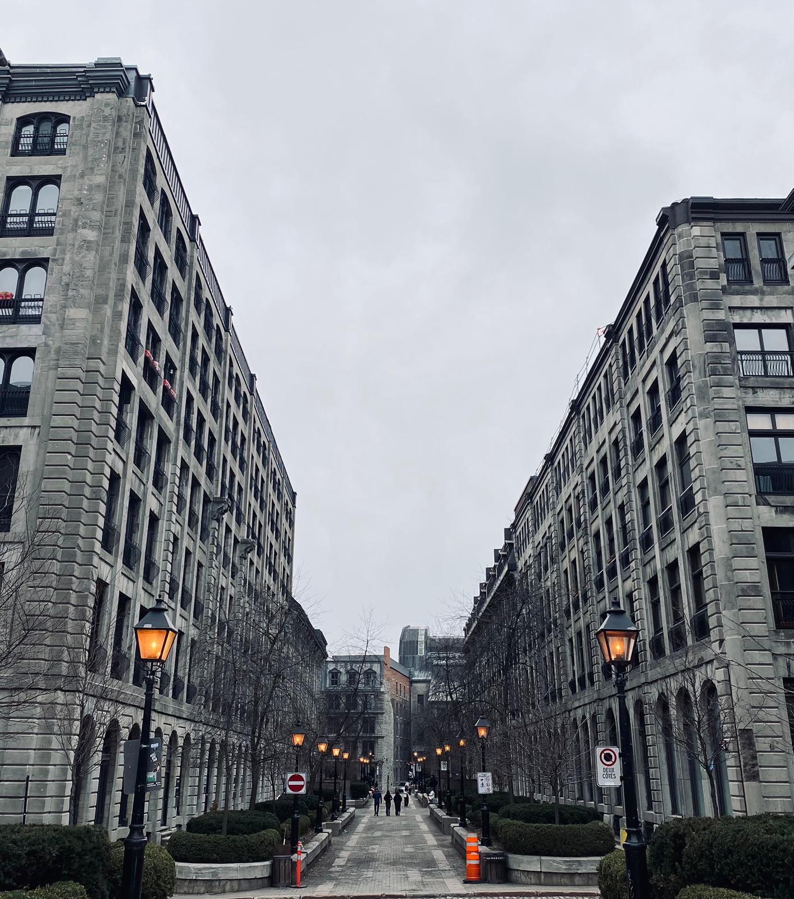

  

    

    <strong>14/04/2026</strong>  
    📄 New
    <a href="https://www.tandfonline.com/doi/full/10.1080/09658211.2026.2655432"> paper
    </a> out in <i> Memory </i> with members of the CeRCa team (University of Tours) and Prof. Erika Borella (University of Padova). 
  

    

  

  

    

      <strong>09-11/04/2026</strong>  
      📣 Poster presentation at the Cognitive Development Society meeting in Montreal.
    

  
  

    <em>Rue le Royer, Montréal, 12th April 2026</em>
  

  

    

      <strong>09/02/2026</strong>  
      🇪🇺 Marie Skłodowska-Curie Global Postdoctoral Fellowship awarded.
    

  

  

    

      <strong>30/01/2026</strong>  
      🎤 Departmental talk at the University of St Andrews.
    

  

<!--
📄 publication
🎤 talk
📣 conference presentation
🏅 fellowship / award
💰 grant
👨‍🔬 collaboration / visitor
✈️ conference travel
📰 media
-->
