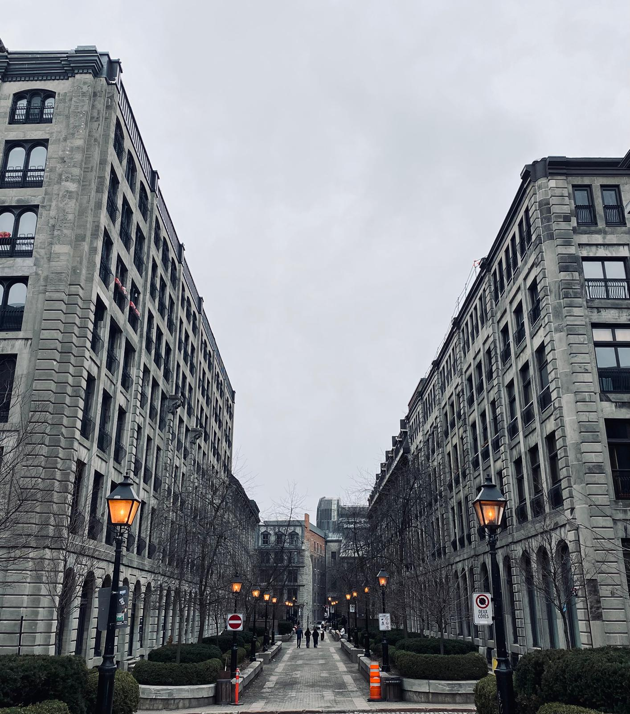
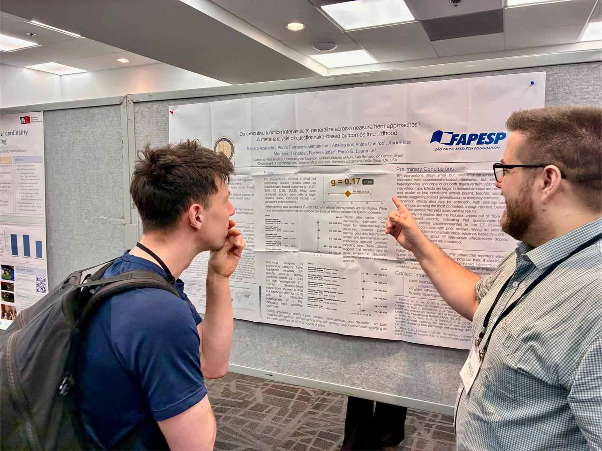

<strong style="min-width: 80px; flex-shrink: 0;">20/07/26</strong>
    
      📄 New
      <a href="https://doi.org/10.1037/neu0001102">paper</a>
      out in <I>Neuropsychology</i> from my previous postdoctoral position at the GIGA-CRC Imaging Human (Liège, Belgium) with Anaïs Servais (lead author), François Meyer, Christine Bastin (Université of Liège) and Emma Delhaye (University of Lisboa).
      
    

  

<strong style="min-width: 80px; flex-shrink: 0;">17/07/26</strong>
    
      🎉 Delighted to have been nominated for the Watson-Arnott Award (Outstanding Early Career Researcher) and very grateful to my colleagues at the School of Psychology and Neuroscience, University of St Andrews, for their support and recognition.
      
    

  

<strong style="min-width: 80px; flex-shrink: 0;">21/05/26</strong>
    
      🎤 Seminar talk at the University of Portsmouth (Centre for Research on Interaction, Development and Diversity).
    
  

  

<strong style="min-width: 80px; flex-shrink: 0;">14/05/26</strong>
  
    🎉 Congratulations to Wenjia Tan, a former RA, for receiving a funded PhD offer from the University of Edinburgh (Informatics).
  

  

<strong style="min-width: 80px; flex-shrink: 0;">14/04/26</strong>
    
      📄 New
      <a href="https://www.tandfonline.com/doi/full/10.1080/09658211.2026.2655432">paper</a>
      out in <i>Memory</i> with members of the CeRCA team (University of Tours) and Prof. Erika Borella (University of Padova).
    
  

  

<strong style="min-width: 80px; flex-shrink: 0;">09–11/04/26</strong>
  
    📣 Poster presentation at the Cognitive Development Society meeting in Montreal.
  

  

    
    

      Rue le Royer, Montréal
    

  

  

    
    

      With Paulo at CDS 2026 (credit: Jesse Niebaum)
         

    

  

  

    <strong>09/02</strong>
    
      🇪🇺 Marie Skłodowska-Curie Global Postdoctoral Fellowship awarded.
    
  

  

    <strong>30/01</strong>
    
      🎤 Departmental talk at the University of St Andrews.
    
  

